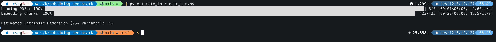
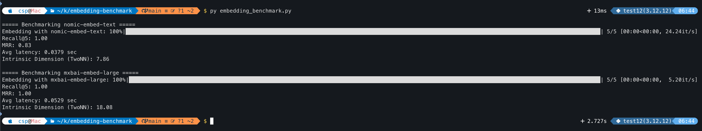
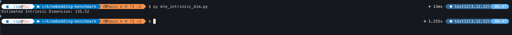
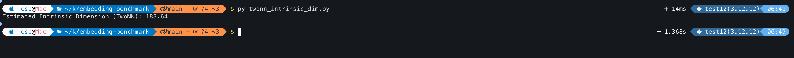
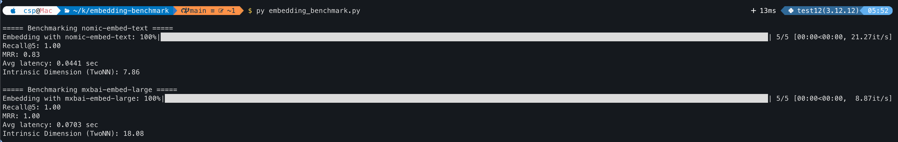
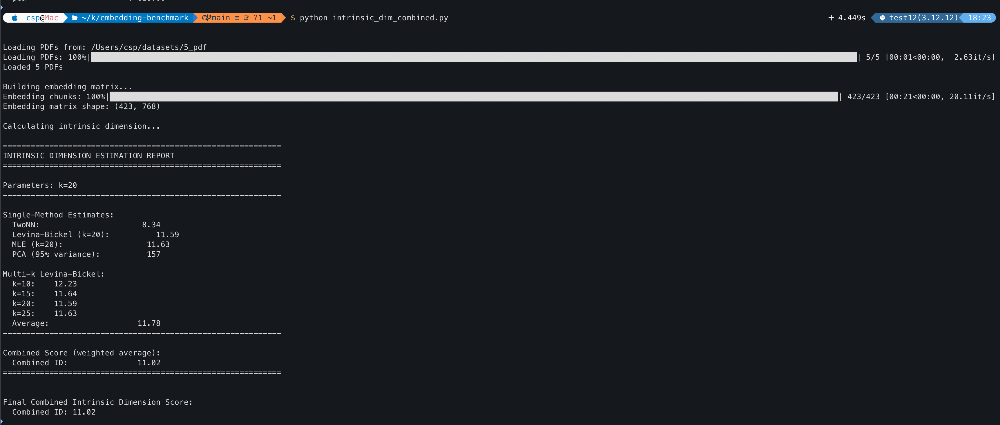

# embedding-benchmark

A benchmarking script for evaluating embedding models using Ollama, FAISS, and scikit-learn.

## Features

- Embed documents and queries using Ollama models (e.g., nomic-embed-text, mxbai-embed-large)
- FAISS-based similarity search with Recall@5 and MRR metrics
- Intrinsic dimension estimation using multiple algorithms

## Intrinsic Dimension Estimation Theory

### What is Intrinsic Dimension?

The intrinsic dimension (ID) of a dataset measures the minimum number of parameters needed to describe the data accurately. High-dimensional embeddings often lie on a lower-dimensional manifold, and ID captures this effective dimensionality.

### TwoNN (Two-Nearest-Neighbor) Estimator

The TwoNN estimator uses the ratio of distances to the first and second nearest neighbors.

**Algorithm:**
1. For each point, compute distances to its 1st and 2nd nearest neighbors: r₁ and r₂
2. Compute the ratio μ = r₂/r₁
3. The cumulative distribution of μ follows: F(μ) = 1 - μ⁻ᵈ where d is the intrinsic dimension
4. Using linear regression on log(μ) and -log(1-F), estimate d from the slope

**Formula:**
```
d = 1 / slope of linear regression on: log(μ_sorted) vs -log(1-F)
```

**Advantages:** Simple, fast, no density assumptions
**Limitations:** Sensitive to noise and boundary effects

---

### Levina-Bickel MLE Estimator

A maximum likelihood estimator based on the distribution of k-nearest neighbor distances.

**Algorithm:**
1. For each point, find k nearest neighbors
2. Compute distances from each point to its k neighbors
3. For point i, the MLE estimate is: (k-1) / Σ log(Tₖ/Tⱼ) where Tₖ is the max distance
4. Average estimates across all points

**Formula:**
```
d_i = (k-1) / Σ_{j=1}^{k-1} log(r_{i,k} / r_{i,j})
d = mean(d_i for all i)
```

**Advantages:** More robust than TwoNN, consistent estimator
**Limitations:** Requires choosing k (typically 10-25)

---

### PCA-Based Estimator

Uses the explained variance ratio from Principal Component Analysis.

**Algorithm:**
1. Apply PCA to the embedding matrix
2. Compute cumulative explained variance ratio
3. Find the smallest number of components explaining a threshold (e.g., 95%) of variance

**Formula:**
```
d = min{k : Σ_{i=1}^k λ_i / Σ_{j=1}^n λ_j ≥ threshold}
```

where λᵢ are eigenvalues in descending order.

**Advantages:** Intuitive, uses well-established PCA
**Limitations:** Assumes linear manifold, sensitive to scaling

---

### MLE (Levina-Bickel) Implementation

Similar to Levina-Bickel but implemented with a different computational approach.

**Algorithm:**
1. For each data point, compute distances to k nearest neighbors
2. Calculate local dimension estimate using log-ratio of distances
3. Average across all points

**Formula:**
```
d = (1/n) Σ_{i=1}^n [(k-1) / Σ_{j=1}^{k-1} log(r_{i,k} / r_{i,j})]
```

## Requirements

See `requirements.txt` for dependencies.

## Usage

1. Start Ollama locally:
```bash
ollama serve
```

2. Run the benchmark:
```bash
python embedding_benchmark.py
```

## Models

Currently supports benchmarking multiple embedding models. Add or modify models in the `MODELS` list.


## Screenshots

### estimate_intrinsic_dim.py (PCA-based)


### embedding_benchmark.py (TwoNN)


### levina_bickel_id.py


### mle_intrinsic_dim.py


### twonn_intrinsic_dim.py






### Combined


## Interpreting Intrinsic Dimension Results

### What Does the Score Mean?

The intrinsic dimension score (e.g., **11.02**) tells you the effective dimensionality of your embedding space. For context:

| ID Score | Interpretation |
|----------|----------------|
| 1-5      | Very low dimensionality (simple structure) |
| 5-15     | Low to moderate dimensionality |
| 15-50    | Moderate dimensionality |
| 50-100   | High dimensionality |
| 100+     | Very high dimensionality (near raw embedding size) |

### Your Result: **11.02**

This indicates your PDF embeddings have **low to moderate intrinsic dimensionality**. Key implications:

- **Efficiency**: You could reduce dimensionality significantly (e.g., from 768 to ~10-15) with minimal information loss
- **Manifold structure**: The embeddings lie on a relatively simple geometric manifold
- **Storage/computation**: Lower-dimensional representations would work well for similarity search
- **Overparameterization**: The original 768 dimensions are more than needed

### Why Multiple Methods?

Different estimators give slightly different results:
- **TwoNN (8.34)**: Simpler, faster, may underestimate slightly
- **Levina-Bickel (11.59-11.78)**: More robust, consistent
- **MLE (11.63)**: Similar to Levina-Bickel
- **PCA (157)**: Much higher - captures linear variance, not intrinsic manifold

The **combined score (11.02)** weights the more robust multi-k Levina-Bickel estimator more heavily.

### Practical Next Steps

1. **Dimensionality reduction**: Try PCA/UMAP to project to ~10-15 dimensions
2. **Quantization**: Low ID suggests 8-bit quantization will work well
3. **Index selection**: For FAISS, IVF or HNSW work well with low-ID data
4. **Model selection**: If ID is low, smaller embedding models may suffice
